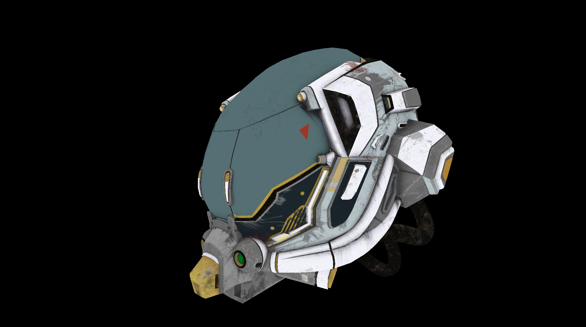

# vk-renderer

A Vulkan renderer written in C++20, focused on modern rendering techniques including dynamic rendering, multi-draw indirect (MDI), and bindless textures. It currently loads glTF models and renders their base color textures and material color factors, without lighting.




## Building

### Prerequisites

- A C++20-capable compiler and a CMake-compatible build tool (Make, Ninja, or Visual Studio).
- [CMake](https://cmake.org/download/) 3.26 or newer, recommended for the bundled Slang build.
- Git and Python 3. Python is required by Slang's dependencies.
- The [Vulkan SDK](https://vulkan.lunarg.com/sdk/home) with Vulkan 1.4 headers and the Vulkan loader installed.
- Internet access for CMake to download dependencies during the initial configuration.

On macOS, install the Xcode Command Line Tools (`xcode-select --install`) and activate the Vulkan SDK in the terminal used to build:

```sh
source "$HOME/VulkanSDK/<version>/setup-env.sh"
```

Replace `<version>` with your installed SDK version. If you installed the SDK elsewhere, adjust the path accordingly.

On Linux, also install the [GLFW development dependencies for X11 and Wayland](https://www.glfw.org/docs/3.4/compile.html#compile_deps). On Windows, use a Visual Studio developer terminal with the C++ build tools installed.

### Configure and compile

```sh
git clone https://github.com/hanson777/vk-renderer.git
cd vk-renderer

cmake -S . -B build -DCMAKE_BUILD_TYPE=Release
cmake --build build --config Release --target vk-renderer --parallel 4
```

CMake fetches the versions of GLFW, GLM, volk, Vulkan Memory Allocator, and Slang specified in `CMakeLists.txt`. These libraries do not need to be installed separately. The Vulkan SDK and platform development tools must be installed beforehand.

The first build can take a while because Slang is compiled from source. Subsequent builds reuse the downloaded dependencies and compiled files. Lower `--parallel 4` if the build runs out of memory.

With Make or single-configuration Ninja, the executable is `build/vk-renderer` (`vk-renderer.exe` on Windows). With Visual Studio, it is normally `build/Release/vk-renderer.exe`.

If CMake reports that Vulkan is missing, check that the SDK is installed and its environment is active in the same terminal, then rerun the configure command.

The configure and compile commands have been checked on macOS with an existing dependency cache. A fresh-machine build and Windows/Linux builds have not yet been verified.
